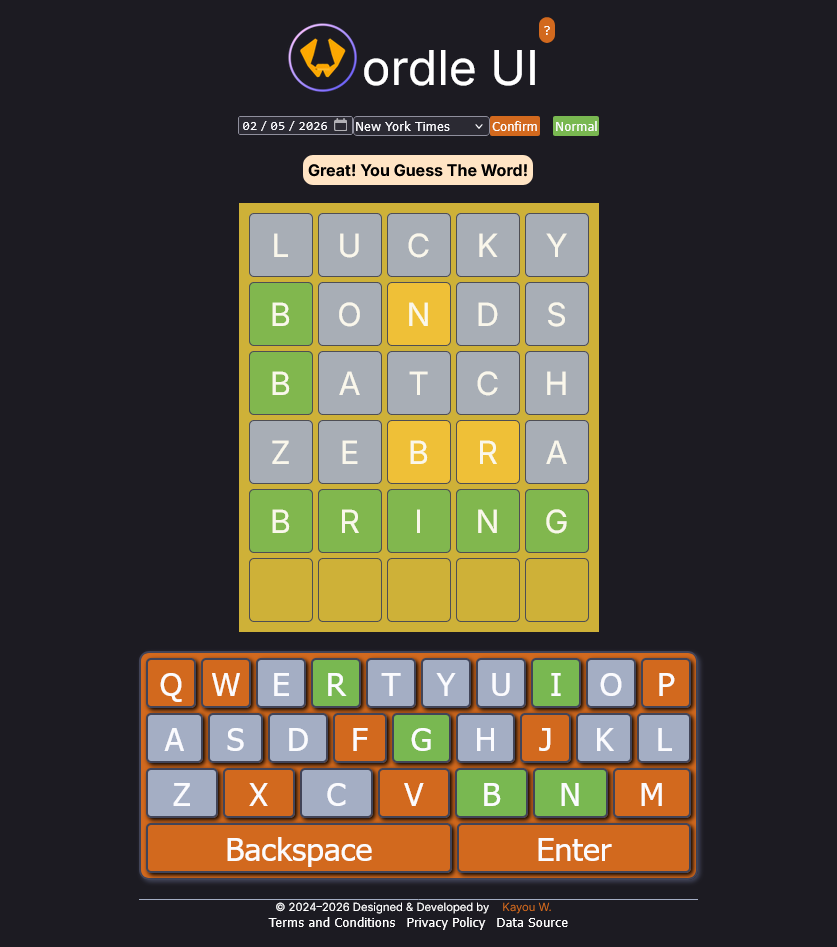

This project features a Wordle game UI developed by integrating a third-party API into the Next.js framework.

## How to play
This game follow the rule of [Wordle](https://www.nytimes.com/games/wordle/index.html).

- you can choose different source of answer and by date. If there is no answer, `No Solution For the date!` will be shown.
    - [Wordle Hints API](https://wordlehints.co.uk/wordle-past-answers/api/) is used in souce type `Wordle Hints Latest` and `Wordle Hints`.
        - `Wordle Hints Latest`: the latest available Wordle answer from Wordle Hints API.
        - `Wordle Hints`: answer of the choosen date
    - `New York Times`: answer from [Wordle](https://www.nytimes.com/games/wordle/index.html). However, there is no offical doc, so it is not gurantee to get the answer.
    - `Demo`: 7 fixed answers that circulate through the week week day.
- [Free Dictionary API](https://freedictionaryapi.com/api/v1/) is used to valid each input guess (i.e. five-letter word).
    - you have 6 guesses in normal mode.
    - you have 4 guesses in hard mode.
    - invalid word will be hightlighted in <span style="color: #b85151">Red</span>
- After the input is validated, it will be compared with the answer character by character. The result of each character will be differentiate by color.
    - <span style="color: #79b851">Green</span>: the character is in the answer, and it is in the correct position.
    - <span style="color: #f3c237">Yellow</span>: the character is in the answer, but it is in the wrong position.
    - <span style="color: #a4aec4">Grey</span>: the character isn't in the answer.
- Once you have guessed the answer, a rainbow effect will be shown as below:


## How to run in local
1. install NodeJs
- Currently, I use [v20.11.0](https://nodejs.org/en/blog/release/v20.11.0)

2. install Yarn
- run the follow in terminal:
    ```bash
    npm install --global yarn
    ```

3. install node module
- run the follow in terminal:
    ```bash
    yarn install
    ```

### 4. run

**For development mode**: run the development server
- run the follow in terminal:
```bash
yarn dev
```
- After Ready, Open [http://localhost:3000](http://localhost:3000) with your browser to see the result.

\
**For production mode**: run the production server:
- run the follow in terminal:
```bash
yarn build
yarn start
```
After Serving, Open [http://localhost:3000](http://localhost:3000) with your browser to see the result.

**For static page**: export static page and serve
- run the follow in terminal:
```bash
yarn export
yarn serve
```
After Serving, Open [http://localhost:3000](http://localhost:3000) with your browser to see the result. 

## Deploy in Github
1. create `production` enviornment variable 
    - `WEB_BASE_PATH` with base path of this github page (i.e. `/wordle`).
2. Run Github action `Deploy Next.js site to Pages`
3. After deploy, Open the Gihub page (i.e. [https://kayouwu.github.io/wordle](https://kayouwu.github.io/wordle)) with your browser to see the result.

## Legal & Attribution
- **Design & Code**: © 2024-now [Kayou W.](https://kayouwu.github.io).
- **Data Sourcing**: Answers and definitions are fetched via a Next.js proxy. 
- **Documentation**: Detailed attribution regarding specific data usage is integrated into the **"How to Play"** modal within the UI.
- **Disclaimer**: Not affiliated with the The New York Times Company; Wordle is a trademark of The New York Times Company.
