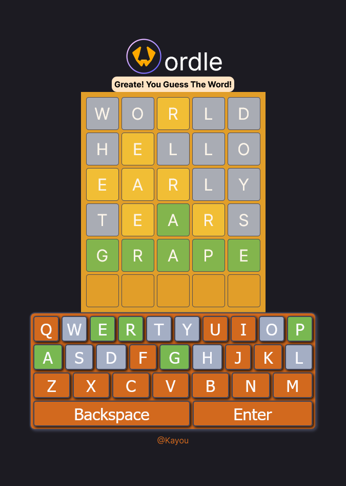

This a ui project for Wordle Game.

## How to run in local
1. install NodeJs
- Currently, I use [v20.11.0](https://nodejs.org/en/blog/release/v20.11.0)

2. install Yarn
- run the follow in terminal:
    ```bash
    npm install --global yarn
    ```

3. install node module
- run the follow in terminal:
    ```bash
    yarn install
    ```

### 4. run

**For development mode**: run the development server
- run the follow in terminal:
```bash
yarn dev
```
- After Ready, Open [http://localhost:3000](http://localhost:3000) with your browser to see the result.

\
**For production mode**: run the production server:
- run the follow in terminal:
```bash
yarn build
yarn start
```
After Serving, Open [http://localhost:3000](http://localhost:3000) with your browser to see the result.

**For static page**: export static page and serve
- run the follow in terminal:
```bash
yarn export
yarn serve
```
After Serving, Open [http://localhost:3000](http://localhost:3000) with your browser to see the result. 

## Deploy in Github
1. create `production` enviornment variable 
    - `WEB_BASE_PATH` with base path of this github page (i.e. `/wordle`).
2. Run Github action `Deploy Next.js site to Pages`
3. After deploy, Open the Gihub page (i.e. [https://kayouwu.github.io/wordle](https://kayouwu.github.io/wordle)) with your browser to see the result.

